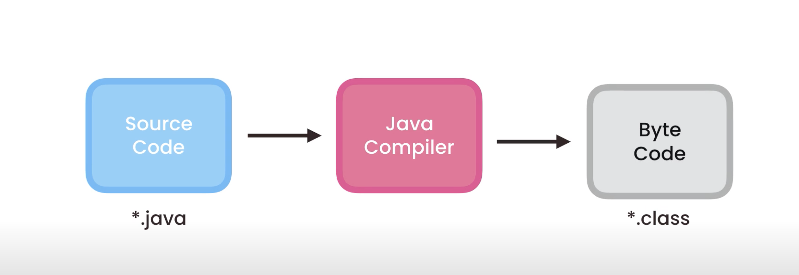
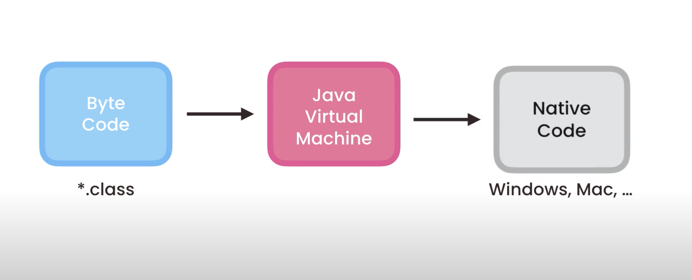
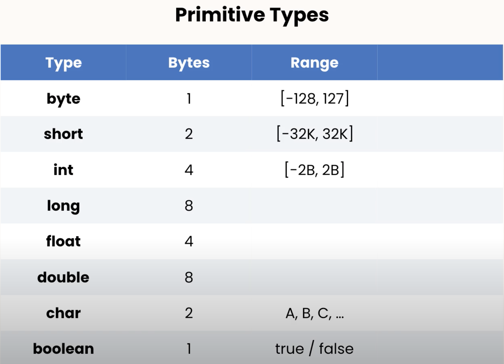

# Intro to Java
## Setting Up: 
1. Download  [JDK(Java Development Kit)](https://www.oracle.com/java/technologies/downloads/)
2. You will need to downloard this link in [vscode](https://code.visualstudio.com/docs/languages/java) in order to run your project in java. 
## Anatomy of Java Program

### Function
    smallest block of code which is reusable and  performs a task 

    - need to specify the type of the function by what the return ( return type)some return a value and some don't return anything. 

  ```java
  ReturnType Name(parameter){

  }
  ```
  if they dont return anything the return type will be *Void*:
  ```java
   void sendEmail() {

   }
```

Every Java program has at least one function which is responsible for out program and that is called *main()* 
```java
void main(){

}
``` 
this is that entry point to our program 
We should note that these function dont stand on their own and they always belong to a *class*

Class is a container for one or more related functions. We use classed to organize out code. 

Every java program has at least one class that contains the main function and that is called *Main*
```java
class Main {
    void main(){

    }
}
```
a *Method* is a function that is a part of a class. The main method in the program should always be static
in Java all these functions and classes must have an *Access Modifier*. An Access Modifier is a special is a special keyword that determines if other functions and classes in this program can acces this class and its methods. We have different Access Modifiers like *Public* or *Private* and so on. so we put that in front of out methods and classes 
```java
public class Main {
    public static void main(){
        ...
    }
}
```
### Naming conventions 
- classes: PascalNamingConvention
- Methods: camelNamingConvention


## How Java gets Executed 
 2 steps: 
 1. compilation 
    - the compiler will compile the source code into Java Bytecode
    - the compiler comes with the developer kit that we downloaded at the beginning of the course

 2. execution 
    - Java Runtime Environment
    - it has a software compartment call Java Virtual Machine. The (JVM) will take our ByteCode and transform it to Native Code  ( this is why Java applications are portable or platform independent) C# and Python also have the same architecture and they are platform independent as well. 


 ## 5 Interesting Facts about Java

 1. was developed by James Gosling in 1995 at Sung Software which was later acuired by oracle in 2010
 2. it was named oak after a tree outside Gosling office later was changed to green and after to Java the coffee. 
 3. there are 4 editions of java for building different kinds of applications. 
    1. Standard Edition(SE)
        - core platform contains all libraries
    2. Enterprise Edition(EE)
        - very large scale and distributed systems built on top of SE
        - has additional libraries and 
    3. Micro Edition (ME)
        - subset of SE designed for mobile 
    4. Java Card
        - smart cards 

4. haz 9 million users around the globe and 
5. average salary of developer is over 100k. 


## Intro
Variables and Constants
Primitive and Reference Types 
Casting (Type Conversion)
Numbers, Strings and Arrays
How to read input from the user


## Variables

```java
    public class IntroToJava {
        public static void main (String[] args){
            int myAge = 30;
            int temperature = 20;
            int herAge = myAge;
            System.out.println(herAge);
            System.out.println(temperature);
        }
    }


```
### Primitive Types (storing simple values)
    


```java
    public class IntroToJava {
        public static void main (String[] args){
            byte myAge = 30;
            int viewsCount = 123_456_789; //instead of coma(,)that is used in accounting, in java we use underscore to separate every 3 digits. 
            long doubleViewsCount = 3_123_456_789L; // the L at the end is an indication of long data type 
            float price = 10.99F;
            char letter = 'A'; // we surround single letters with single quotes and multiple characters with double quotes.
            boolean isEligible = false;
            System.out.println(herAge);
            System.out.println(temperature);
        }
    }


```
### Reference Types (storing complex objects)
declaring and initializing a reference type is slightly different from the primitive type. 
we use the *"new"* keyword to allocate memory for a reference type; It is an instace of a class with members of the same class;

### Primitive vs Reference Types
The difference is in *memory management* : 

When we declare a primitive variable like a byte the value that we assign to that variable will be stored in that memory location.  But, when we use a reference type, 
our variable  is going to hold the address of that object in memory not the actual object. 

Reference types are copied by the references whereas the primitive types are copied by their value. And these values are completely independent of each other. 


## String:
Strings are reference types in java but the shorthand looks like primitive type. But because we use them often there is a short way to write them. we can concatenate them using a + joining them. 
in java stings are immutable ad we can not change them. Below are some useful method for the String class in java.

```java
public class Main {
    public static void main(String[] args){
       String message = "Hello world" + "!!!";
       // Strings are reference types in java but the shorthand looks like primitive type.
       System.out.println(message.startsWith(" !!"));
       System.out.println(message.length());
       System.out.println(message.endsWith("!!!"));
       System.out.println(message.indexOf("e"));
       System.out.println(message.replace("!", "*")); // this method does not modify the original string it creates a new one. 
       System.out.println(message.toLowerCase());
       System.out.println(message.toUpperCase());
       System.out.println(message.trim()); // gets rid of whitespace
    }
}
```
#### Special characters in strings ( Escape Sequences)
- A (\\") 
- A (\\) backslash will escape the special characters in the string
- A (\n) java will add a new line to the string
- A (\t) java will add a tab to 
```java
public class Main {
    public static void main(String[] args){
       String message = "Hello \" Tara\""; // backslash escapes the double quote
       String msgeTwo = "c:\\Windows\\System32\\CurrentVersion";
       String newLinemsg = "c:\\Windows\n System32\nCurrentVersion";
       String withTabMsg = "c:\tWindows\\System32\\CurrentVersion";
       System.out.println(message);
      
    }
}
```
## Arrays

### Multi-dimensional Arrays

## Constants

## Arithmetic Expressions

### Order of Operations

## Casting 

## The Math Class

## Formatting Numbers

## Reading Input
Scanner Class
System.in


